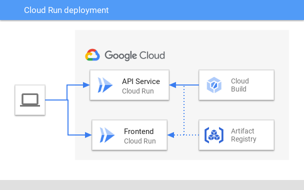
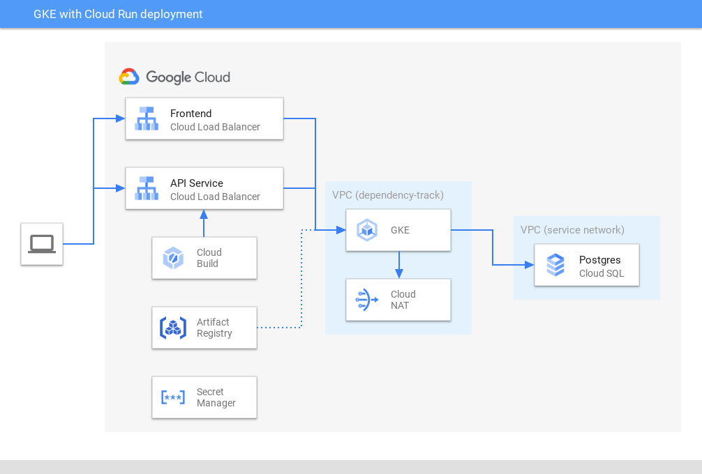
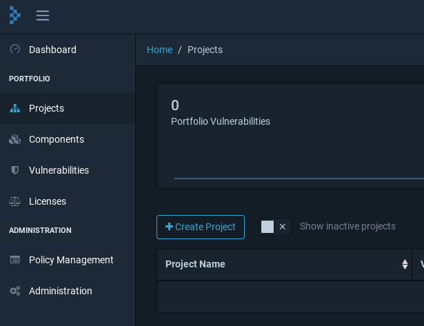
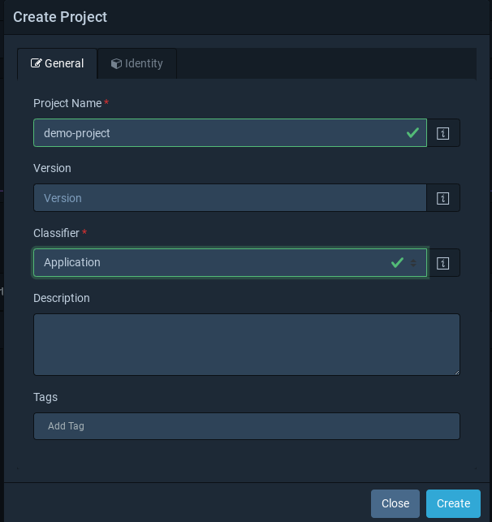
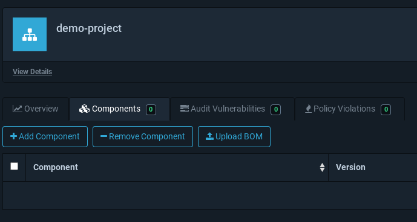
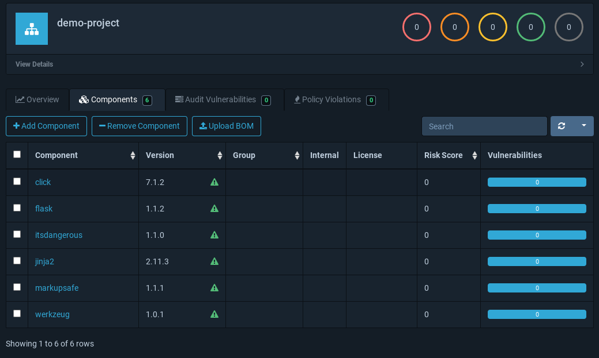
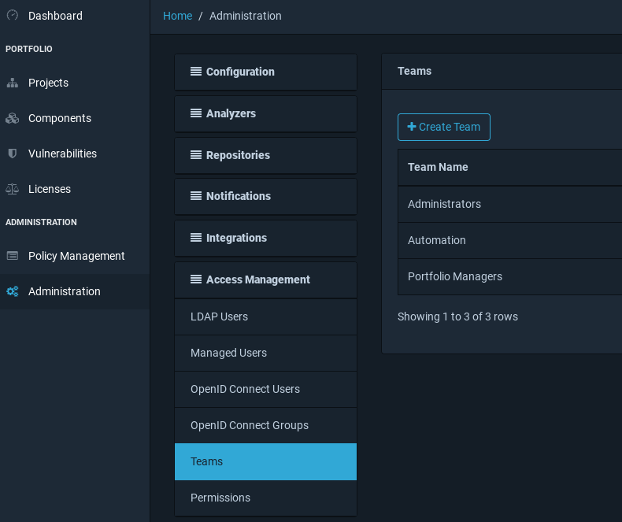
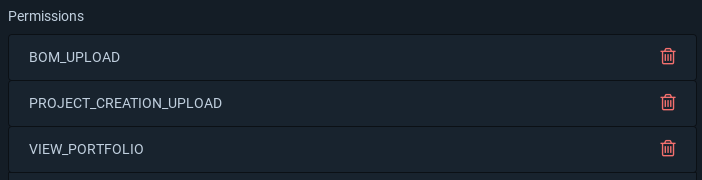
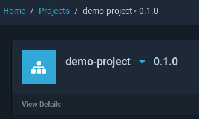

Duncan Dickinson | Customer Engineer | Google

<p style="background-color:#CAFACA;"><i>Contributed by Google employees.</i></p>

The [OWASP Dependency-Track project](https://owasp.org/www-project-dependency-track/)
is a component analysis platform for tracking dependencies, their 
licences and associated vulnerabilities. It's a very useful tool to get up and running as
you build out your software supply chain approach.

Dependency Track accepts Software Bill of Materials (SBOMs) in [CycloneDX](https://cyclonedx.org/)
format. This can be provided either on an ad-hoc basis or as part of your deployment system.
The approach is useful in a number of scenarios:

- Software vendors can provide you SBOMs when they deliver/sell you a software project
- Teams building and deploying software can submit SBOMs when new versions are deployed
- You can manually list dependencies for legacy systems

Using Dependency Track gives you one element towards managing your approach to monitoring 
and responding to  
[Using Components with Known Vulnerabilities](https://owasp.org/www-project-top-ten/2017/A9_2017-Using_Components_with_Known_Vulnerabilities)
from the OWASP Top-10. The idea is to have an inventory of components in use across your environment. 
Using a variety of resources such as the 
[National Vulnerability Database](https://docs.dependencytrack.org/datasources/nvd/)
you can then determine if you have vulnerable components and respond in accordance with your 
organisation's processes. 

This tutorial deploys [Dependency Track](https://dependencytrack.org/) to Google Cloud
and illustrates its use in a small Python demo.

## Objectives

1. [_Generate an SBOM_](#generate-an-sbom) takes you through creating an SBOM for a basic project.
1. [_Deploy Dependency Track_](#deploy-dependency-track) provides basic setup for a deployment. 
    Two pathways are offered for deployment: 
    - Cloud Run for a quick demo rollout
    - Google Kubernetes Engine and Cloud SQL for a more long-term approach
1. [_Using Dependency Track_](#using-dependency-track) will then demonstrate uploading an SBOM and integrating
    Cloud Build.


## Costs

This tutorial uses billable components of Google Cloud, including the following:

*   [Artifact Registry](https://cloud.google.com/artifact-registry)
*   [Container Analysis](https://cloud.google.com/container-analysis/docs/container-analysis)
*   [Cloud Run](https://cloud.google.com/run)
*   [External IP address](https://cloud.google.com/compute/docs/ip-addresses/reserve-static-external-ip-address)
*   [Google Kubernetes Engine](https://cloud.google.com/kubernetes-engine)
*   [Cloud SQL](https://cloud.google.com/sql/)

Use the [pricing calculator](https://cloud.google.com/products/calculator) to generate a cost estimate
based on your projected usage.

## Before you begin

In order to follow this tutorial, you need to be comfortable using the Linux shell.

You will need a [Google Cloud](https://cloud.google.com/) account and a 
[project](https://cloud.google.com/resource-manager/docs/creating-managing-projects) with
a billing account attached. It is strongly recommended that you create a project specifically
for this tutorial and not reuse an existing project. You will need to be a 
[project owner](https://cloud.google.com/iam/docs/understanding-roles#basic-definitions)
for your chosen project.

You should follow this guide in [Cloud Shell](https://cloud.google.com/shell) 
as it has all of the software required by this tutorial.

If you choose to deploy Dependency Track to Cloud Run you do not have any further prerequisites.

If you choose to deploy Dependency Track to Google Kubernetes Engine you will need 
access to a domain for which you can create two sub-domains - one for each of the 
Frontend and the API Server. If you do not have a domain you can visit
[Google Domains](https://domains.google.com) and register one there.

### Prepare your shell

Enter the commands below into Cloud Shell - 
_making sure you replace `<YOUR PROJECT ID>` with your desired Project ID._:

```bash
export GCP_PROJECT_ID=<YOUR PROJECT ID>
gcloud config set project $GCP_PROJECT_ID

export GCP_REGION=us-central1
```

### Clone the repository

This tutorial utilises a number of files so we'll clone the tutorial 
repository and change into this tutorial's directory:

```bash
git clone https://github.com/GoogleCloudPlatform/community.git
cd community/tutorials/deploy-dependency-track
```

## Generate an SBOM

The demonstration ("demo") project has no code - 
it's just there to include some libraries (namely `flask`).

Run the following commands in Cloud Shell to set up the project:

```bash
# Upgrade pip 
python3 -m pip install poetry

# Prepare the demo project
cd demo-project
poetry install
```

Now run `poetry show --tree` and you will see the project's set of dependencies (snippet below):

```
flask 1.1.2 A simple framework for building complex web applications.
├── click >=5.1
├── itsdangerous >=0.24
├── jinja2 >=2.10.1
│   └── markupsafe >=0.23 
└── werkzeug >=0.15
```

The [CycloneDX](https://cyclonedx.org/) project defines a schema for 
software bill of materials (SBOMs) as well as providing 
[tools](https://cyclonedx.org/tool-center/) that can be used with various programming languages
and CI/CD tools. 
The Python version ([`cyclonedx-bom`](https://pypi.org/project/cyclonedx-bom/)) is included 
as a development dependency of the demo project. 

Use `poetry` to generate a `requirements.txt` file:

```bash
poetry export --without-hashes>requirements.txt
```

You'll see the familiar `requirements.txt` file has been created. 

Now, generate a JSON-formatted Cyclone DX SBOM:

```bash
poetry run cyclonedx-py -j
```

The `requirements.txt` file  is read by `cyclonedx-py` to produce `bom.json`.
Taking a look at that file you can see some interesting
aspects of the SBOM. Each of the `components` contains details for each dependency - for example:

```json
{
    "description": "A simple framework for building complex web applications.",
    "hashes": [
        {
            "alg": "MD5",
            "content": "1811ab52f277d5eccfa3d7127afd7f92"
        },
        {
            "alg": "SHA-256",
            "content": "8a4fdd8936eba2512e9c85df320a37e694c93945b33ef33c89946a340a238557"
        }
    ],
    "licenses": [
        {
            "license": {
                "name": "BSD-3-Clause"
            }
        }
    ],
    "modified": false,
    "name": "flask",
    "publisher": "Armin Ronacher",
    "purl": "pkg:pypi/flask@1.1.2",
    "type": "library",
    "version": "1.1.2"
}
```

From that snippet you can see:

- The component details - name, publisher, version etc
- The licenses on the project
- A [Package URL (purl)](https://github.com/package-url/purl-spec) for the project (`pkg:pypi/flask@1.1.2`) - used 
    to easily reference/identify a component across the veritable sea of languages and packaging types/protocols
    in use today

We'll return to the `bom` file when we've set up a Dependency Track service.

## Deploy Dependency Track

This tutorial provides 2 pathways for deploying Dependency Track:

1. Deploy a quick demonstrator to Cloud Run
1. Setup a more long-term environment in Google Kubernetes Engine (GKE) and Cloud SQL -
   _this requires you to have the ability to add subdomains to a domain name under your control_.

Before taking either pathway we'll prepare the Dependency Track container images for use in Cloud Run or GKE.
There are two images we need:

- The `frontend` image provides the web-based user interface
- The `apiserver` image provides an Open API-based interface that is used by the frontend and when 
  interacting with Dependency Track from other systems (such as submitting a BOM)

### Set up the Dependency Track images

The [Artifact Registry](https://cloud.google.com/artifact-registry) service will be utilised
to store container images. [Container Analysis](https://cloud.google.com/container-analysis/docs/container-analysis)
is also enabled to provide vulnerability scans of the images being used.

First up we'll enable the relevant APIs and set the default location for image storage:

```bash
gcloud services enable  artifactregistry.googleapis.com \
                        containerscanning.googleapis.com

gcloud config set artifacts/location $GCP_REGION
```

Next, configure the `dependency-track` image repository:

```bash
gcloud artifacts repositories create dependency-track \
              --repository-format=docker

export GCP_REGISTRY=$GCP_REGION-docker.pkg.dev/$GCP_PROJECT_ID/dependency-track
```

In order to push images to the repository you need to configure docker with the required authentication:

```bash
gcloud auth configure-docker $GCP_REGION-docker.pkg.dev
```

Now it's just a case of pulling the required images from the Docker Hub and pushing it to 
your repository. 

Start with the Dependency Track API server:

```bash
docker pull docker.io/dependencytrack/apiserver:4.1.0
docker tag docker.io/dependencytrack/apiserver:4.1.0 $GCP_REGISTRY/apiserver:4.1.0
docker push $GCP_REGISTRY/apiserver:4.1.0
```

And then pull/push the user interface (frontend) component:

```bash
docker pull docker.io/dependencytrack/frontend:1.2.0
docker tag docker.io/dependencytrack/frontend:1.2.0 $GCP_REGISTRY/frontend:1.2.0
docker push $GCP_REGISTRY/frontend:1.2.0  
```

You can always check your image collection with the following command:

```bash
gcloud artifacts docker images list $GCP_REGISTRY
```

### Deploy to Cloud Run

In this pathway we'll configure Dependency Track to run in [Cloud Run](https://cloud.google.com/run).
This is a useful approach for quickly creating a demo instance for evaluation purposes.
As you can see in the diagram below, two Cloud Run services are created to serve the
Dependency Track Frontend and API Server. The previously configured Artifact Registry
provides the container images used in the Cloud Run services.



Enable the Cloud Run API and set the default region. We'll also use the `managed` platform approach
(rather than an Anthos platform):

```bash
gcloud services enable run.googleapis.com 

gcloud config set run/platform managed
gcloud config set run/region $GCP_REGION
```

#### Deploy the API Server

Launch the API Server in Cloud Run with the following command:

```bash
gcloud run deploy dependency-track-apiserver \
  --image $GCP_REGISTRY/apiserver:4.1.0 \
  --allow-unauthenticated --cpu=2 --memory=8Gi --port=8080
  
export DT_APISERVER=$(gcloud run services describe dependency-track-apiserver \
                        --format="value(status.url)")

echo $DT_APISERVER
```

Once deployed you'll get a URL to access the API Server.
The API Server can take a while (up to 30-mins) to download the required data from various data sources.
Review the Cloud Run [Logging and viewing logs](https://cloud.google.com/run/docs/logging) 
guide to check your logs.

#### Deploy the frontend

Launch the Frontend in Cloud Run with the following command:

```bash
gcloud run deploy dependency-track-frontend \
  --image $GCP_REGISTRY/frontend:1.2.0 \
  --allow-unauthenticated --cpu=2 --memory=1Gi --port=80 \
  --set-env-vars="API_BASE_URL=$DT_APISERVER"
```

#### Next steps

Now that the Cloud Run services have been configured, move on to the
[Using Dependency Track](#using-dependency-track) section.

### Deploy to Google Kubernetes Engine and Cloud SQL

The Cloud Run pathway is a quick demo approach that uses an embedded H2 database. The recommended 
[Dependency Track resources]([https://docs.dependencytrack.org/getting-started/deploy-docker/])
are rather hefty with the API Server looking for 4 CPU cores and 16GB RAM - exceeding what we
can get from Cloud Run.

For a more substantial approach, this pathway configures the system to run in 
Google Kubernetes Engine (GKE) and use a Cloud SQL Postgres database. 

Before you continue please note that you will need access to a domain in which you can create two
sub-domains - one for each of the Frontend and the API Server. This is necessary as we'll be creating
TLS certificates for the domains. 

This pathway is much more involved that the Cloud Run option. As you can see from
the diagram below, a number of services will be utilised:

- The Dependency Track Frontend and API Server components will be hosted as
  GKE pods, fronted by Cloud Load Balancers. The required container images will
  be hosted in the Artifact Registry.
- The GKE instance will operate as a private cluster so a Cloud NAT will be 
  required for outbound requests - primarily Dependency Track downloading its 
  various datasources.
- A Postgres-based Cloud SQL database will be used to hold Dependency Track data.
- Secret Manager will be used to securely store database passwords.



A [_Troubleshooting_](#troubleshooting) section has been provided to help out with
issues that you may encounter.

#### Initial set up

There's quite a few services we'll need to enable:

- GKE (`container.googleapis.com`)
- Compute Engine (`compute.googleapis.com`) (runs the VMs hosting GKE nodes)
- Cloud SQL (`sql-component.googleapis.com`)
- Cloud SQL Admin (`sqladmin.googleapis.com`)
- Secret Manager (`secretmanager.googleapis.com`)
- Service Networking (`servicenetworking.googleapis.com`)
    (provides functionality needed for Cloud SQL private instances)

This is all enabled with the following command:

```bash
gcloud services enable  compute.googleapis.com \
                        container.googleapis.com \
                        sql-component.googleapis.com \
                        sqladmin.googleapis.com \
                        secretmanager.googleapis.com \
                        servicenetworking.googleapis.com
```

It's useful to designate a default region for Compute Engine (which runs the GKE worker nodes):

```bash
gcloud config set compute/region $GCP_REGION
```

Add your domains to the commands below. 
`DT_DOMAIN_API` will provide the API Server (e.g. `api.example.com`)
and `DT_APISERVER` is its URL (e.g. `https://api.example.com`).
`DT_DOMAIN_UI` provides the frontend (e.g. `ui.example.com`).

```bash
export DT_DOMAIN_API=<Your chosen domain name>
export DT_APISERVER=https://$DT_DOMAIN_API
export DT_DOMAIN_UI=<Your chosen domain name>
```

#### Create TLS certificates

We'll create TLS certificates for the API and user interface endpoints. 
Whilst this can be done using a
[GKE `ManagedCertificate` resource](https://cloud.google.com/kubernetes-engine/docs/how-to/managed-certs#setting_up_the_managed_certificate),
I've decided to define these outside of Kubernetes with a view that they can be 
transferred as needed.

The provisioning of the certificates can take some time, so it's best to
get these started early:

```bash
gcloud compute ssl-certificates create dependency-track-cert-api \
    --description="Certificate for the Dependency Track API" \
    --domains=$DT_DOMAIN_API \
    --global
    
gcloud compute ssl-certificates create dependency-track-cert-ui \
    --description="Certificate for the Dependency Track UI" \
    --domains=$DT_DOMAIN_UI \
    --global
```

You can check in on the progress of the certificates by running 
`gcloud compute ssl-certificates list`. 

The setup of the certificates only completes when they're aligned to a 
Load Balancer so keep going with the instructions.

#### Create external IPs

Next, set up two external IP addresses:

```bash
gcloud compute addresses create dependency-track-ip-api --global
gcloud compute addresses create dependency-track-ip-ui --global

export DT_IP_API=$(gcloud compute addresses describe dependency-track-ip-api \
                    --global --format="value(address)")
export DT_IP_UI=$(gcloud compute addresses describe dependency-track-ip-ui \
                    --global --format="value(address)")
```

At this point you can add your chosen domain names and the IP addresses to your DNS system. 
As DNS entries can take up to 48-hours to propagate, it's best to get this done now. 

#### Set up a GKE cluster

We'll create a VPC to house the private GKE cluster. 
In the commands below we create a VPC and enable
[private service access](https://cloud.google.com/sql/docs/postgres/configure-private-services-access#configure-access)
- the latter providing the ability to create a Cloud SQL instance without a public IP address.

```bash
gcloud compute networks create dependency-track \
      --description="A demo VPC for hosting Dependency Track" \
      --subnet-mode=custom
      
gcloud compute addresses create google-managed-services-dependency-track \
    --global \
    --purpose=VPC_PEERING \
    --prefix-length=20 \
    --network=dependency-track
    
gcloud services vpc-peerings connect \
    --service=servicenetworking.googleapis.com \
    --ranges=google-managed-services-dependency-track \
    --network=dependency-track \
    --project=$GCP_PROJECT_ID
```

Next, we create a private GKE cluster. The code below creates a private cluster, but
the Kubernetes control plane is available on a public endpoint. This will allow you,
for the purposes of this tutorial, to access the cluster with `kubectl` from Cloud Shell. 
In a production environment you'll likely seek to limit access to the control plane. Review 
[Access to cluster endpoints](https://cloud.google.com/kubernetes-engine/docs/concepts/private-cluster-concept#overview)
for further details.

```bash
gcloud container clusters create-auto dependency-track \
    --region=$GCP_REGION \
    --create-subnetwork="name=dependency-track-subnet" \
    --network=dependency-track \
    --no-enable-master-authorized-networks \
    --enable-private-nodes
```

Once the cluster is ready, set up your `kubectl` with the correct credentials 
and check on the client and server versions:

```bash
gcloud container clusters get-credentials dependency-track --region $GCP_REGION

kubectl version
```

The GKE nodes need outbound internet access so that the Dependency Track
system can download its required databases. This requires a Cloud NAT:

```bash
gcloud compute routers create dependency-track-nat-router \
    --network dependency-track \
    --region $GCP_REGION

gcloud compute routers nats create dependency-track-nat \
    --router=dependency-track-nat-router \
    --auto-allocate-nat-external-ips \
    --nat-all-subnet-ip-ranges \
    --enable-logging
```

Now that our GKE environment is ready to go, create a `dependency-track` 
Kubernetes namespace to work in:

```bash
kubectl create namespace dependency-track
kubectl config set-context --current --namespace=dependency-track
```

#### Deploy the Dependency Track frontend

The deployment process makes use of the 
[`kustomize`](https://kubectl.docs.kubernetes.io/guides/introduction/)
functionality build into `kubectl`. 
You'll find the various deployment files under the `deploy` directory.

Importantly, we use the the `envsubst` command to interpolate the various environment variables 
in the deployment files. You need to install the command in your CloudShell environment:

```bash
sudo apt install gettext-base
```

When ready, deploy the frontend workload to the GKE cluster:

```bash
cd deploy/frontend
cat kustomization.base.yaml | envsubst >kustomization.yaml
kubectl apply -k .
```

#### Deploy the API Server

There are more steps involved when deploying the API Server as we're going to 
use a Postgres database. The steps involved are:

1. Create a service account for database access via Cloud SQL Proxy
1. Create the Postgres database in Cloud SQL
1. Deploy the API Server to GKE

##### Set up a service account

As the API Server needs to access a database, we'll create and use a service account with GKE
[workload identity](https://cloud.google.com/kubernetes-engine/docs/how-to/workload-identity).
This will let the [SQL Proxy pod](https://cloud.google.com/sql/docs/postgres/connect-kubernetes-engine)
connect to Cloud SQL via the service account.

The incantation for setting up the service account is below. 

```bash
# 1. Create a kubernetes service account
kubectl create serviceaccount dependency-track

# 2. Create a Google Cloud IAM service account
gcloud iam service-accounts create dependency-track

# 3. Align the kubernetes service account to the IAM service account
gcloud iam service-accounts add-iam-policy-binding \
  --role roles/iam.workloadIdentityUser \
  --member "serviceAccount:$GCP_PROJECT_ID.svc.id.goog[dependency-track/dependency-track]" \
  dependency-track@$GCP_PROJECT_ID.iam.gserviceaccount.com

# 4. Similar to step 3, align the IAM service account to the kubernetes one
kubectl annotate serviceaccount \
  --namespace dependency-track \
  dependency-track \
  iam.gke.io/gcp-service-account=dependency-track@$GCP_PROJECT_ID.iam.gserviceaccount.com
  
# 5. Grant the cloudsql.client role to the IAM service account so that 
#    SQL Proxy can connect to the DB
gcloud projects add-iam-policy-binding $GCP_PROJECT_ID \
  --role roles/cloudsql.client  \
  --member "serviceAccount:dependency-track@$GCP_PROJECT_ID.iam.gserviceaccount.com" 
```

##### Create a Cloud SQL instance

Next up, we''ll set up a Cloud SQL instance running Postgres 11. 

The database passwords will be stored in [Secret Manager](https://cloud.google.com/secret-manager)
so that we don't have to write them down on a scrap of paper. Before you rush into the setup,
__*change the passwords in the commands below*__.

```bash
printf SET_DBADMIN_PASSWORD_HERE | gcloud secrets create dependency-track-postgres-admin \
            --data-file=-
            
printf SET_DBUSER_PASSWORD_HERE | gcloud secrets create dependency-track-postgres-user \
            --data-file=-
```

We can now create the database server and associated user and database:

```bash
export DT_DB_INSTANCE=dependency-track

# 1. Create the Cloud SQL instance
gcloud beta sql instances create $DT_DB_INSTANCE \
            --region=$GCP_REGION \
            --no-assign-ip \
            --network=projects/$GCP_PROJECT_ID/global/networks/dependency-track \
            --backup --backup-start-time=15:00 \
            --database-version=POSTGRES_11 \
            --cpu=4 --memory=15 \
            --storage-auto-increase \
            --root-password=$(gcloud secrets versions access 1 \   
                              --secret=dependency-track-postgres-admin)          

# 2. Set up a database user
gcloud sql users create dependency-track-user \
            --instance=$DT_DB_INSTANCE \
            --password=$(gcloud secrets versions access 1 \
                          --secret=dependency-track-postgres-user)

# 3. Create the database            
gcloud sql databases create dependency-track \
            --instance=$DT_DB_INSTANCE

# 4. We'll need the connection details in the kubernetes configuration
export DT_DB_CONNECTION=$(gcloud sql instances describe $DT_DB_INSTANCE \
                            --format="value(connectionName)")
```

The API Server will need the database user password so this is set up as a Kubernetes secret:

```bash
kubectl create secret generic dependency-track-postgres-user-password \
  --from-literal ALPINE_DATABASE_PASSWORD=$(gcloud secrets versions access 1 \
                                              --secret=dependency-track-postgres-user) 
```

##### Launch the API Server

After all of that we can now fire up the Kubernetes resources much as we did for the frontend:

```bash
cd ../api
cat kustomization.base.yaml | envsubst >kustomization.yaml
kubectl apply -k .
```

The API Server loads a lot of data and takes a long time to be ready. Consider opening
a separate Cloud Shell terminal tailing the logs with:

```bash
kubectl logs -f dependency-track-apiserver-0 dependency-track-apiserver
```

Head to the [Using Dependency Track](#using-dependency-track) section to start using 
the system.

#### Troubleshooting

##### TLS error

If you visit the frontend or API Server you might get a TLS error such as `ERR_SSL_VERSION_OR_CIPHER_MISMATCH`.
Check the TLS certificate status with `gcloud compute ssl-certificates list` - you need both of the
certificates to be listed as "ACTIVE". If you see "FAILED_NOT_VISIBLE" just wait a while for the certificate to
be provisioned to the load balancer. This can take some time (up to 60-minutes).

Check out 
[Troubleshooting SSL certificates](https://cloud.google.com/load-balancing/docs/ssl-certificates/troubleshooting)
for more info.

##### GKE Connectivity

If needed, you can check out the cluster by firing up a `busybox` instance: 

```bash
kubectl run --rm -it --image=busybox -- sh
```

Then run something like: `wget -O - http://www.example.com`

##### Checking the database

If you need to check the database using the `psql` tool, start by reviewing
[Connecting using the Cloud SQL Proxy](https://cloud.google.com/sql/docs/postgres/connect-admin-proxy)

You can install `psql` in Cloud Shell (if it's not already there) with:

```bash
sudo apt install postgresql-client
```

Next, start up a Cloud SQL Proxy in your GKE cluster with the following command:

```bash
kubectl run proxy --port 5432 --serviceaccount=dependency-track \
  --image=gcr.io/cloudsql-docker/gce-proxy:1.17 -- /cloud_sql_proxy \
    -instances=$DT_DB_CONNECTION=tcp:5432 \
    -ip_address_types=PRIVATE
```

Setup a port forwarding on the Postgres port with:

```bash
kubectl port-forward pod/proxy 5432:5432
```

You can now open a new terminal and connect to the Postgres instance with:

```bash
psql "host=127.0.0.1 sslmode=disable dbname=dependency-track user=dependency-track-user"
```

Don't leave the pod hanging around - delete it once you're done:

```bash
kubectl delete pod/proxy
```

## Using Dependency Track

The API Server loads a range of data and will take up to half an hour to be ready.
When it is ready you should see the following line in the logs: 
`[AlpineServlet] Dependency-Track is ready`.

When the API Server is ready, you can now visit the API Server site.
The following paths may be of interest:

- `/api/version` - the service version
- `/api/swagger.json` - the OpenAPI definition

Once you have the Dependency Track API and frontend running, you're ready to login to the frontend - 
just head to the relevant domain:

- If you used the Cloud Run pathway, you can determine the URL by running 
  `gcloud run services describe dependency-track-frontend`. 
- If you went the GKE route, you will have designated a domain name for the URI.

Once you've accessed the frontend, enter `admin`/`admin` for the initial login 
username/password - you'll be prompted to set up a better password. 
Refer to 
[Dependency Track's Initial Startup document](https://docs.dependencytrack.org/getting-started/initial-startup/)
for more information.

In the frontend user interface, go to the "Projects" screen and click on "+ Create Project".



You don't need to enter many details, just use "demo-project" for the Project Name
and set the Classifier to "Application" then press the "Create" button.



You'll see the new project listed - click on it and when in the project screen, 
click on the "Components" tab. 

You will need a local copy of `bom.json` in order to upload it. Use the following
command in the base of the tutorial directory to download a copy to your computer
(_make sure you're in the `demo-project` directory_):

```bash
cloudshell download bom.json
```

You can now click on the "Upload BOM" button and select the `bom.json` file for upload.



When you return to the project screen you should see the components listed. If not,
click on the refresh button to the right of the screen. Take some time to click around
and explore the information.



### Uploading a BOM from the terminal

Uploading a BOM manually is not a long-term solution. Let's take a look at how a BOM
can be directly uploaded to the API. 

In the frontend user interface, go to the "Administration" screen and select "Teams"
from the "Access Management" section.
You'll see a team named "Automation", click on this to view the team's configuration.



Add `PROJECT_CREATION_UPLOAD` permission to the "Automation" team.



Copy the API Key that is displayed for the "Automation" team 
and set up the API Key as a variable in your terminal:

```bash
export DT_API_KEY=<YOUR API KEY>
```

Once you've set up the "Automation" team's permissions and API key you're ready
to upload a BOM to your Dependency Track service. 

Generate and upload the XML version of the BOM:

```bash
# 1. Generate the BOM
poetry install
poetry export --without-hashes>requirements.txt
poetry run cyclonedx-py

# 2. Upload the BOM
poetry run ./bom-loader.py --url $DT_APISERVER --api-key=$DT_API_KEY
```

The `bom-loader.py` script performs the following:

1. Reads the project name and version from the `pyproject.toml` file
1. Loads the BOM (`bom.xml`)
1. Packages the information and submits it to the Dependency Track API server

Now you can go to your Dependency Track frontend and open the "Projects" tab. You'll
see there's now a `demo-project` with version `0.1.0`:


As before, you can click on the project and explore the dependencies.

### Using Cloud Build

For the next iteration of submitting a BOM let's look at integrating the approach with
your CI/CD workflow. 

Start by enabling the Cloud Build and Cloud Storage APIs:

```bash
gcloud services enable cloudbuild.googleapis.com \
  storage-component.googleapis.com
```

Next, we'll create a builder image that we can use in Cloud Build. First,
create a new repository called `builders`:

```bash
gcloud artifacts repositories create builders \
              --repository-format=docker
```

Next, make sure you're in the `demo-project` directory and submit the 
Poetry image to Cloud Build:

```bash
gcloud builds submit support/poetry-image \
  --tag ${GCP_REGION}-docker.pkg.dev/${GCP_PROJECT_ID}/builders/poetry:1
```

The Cloud Build job will create the image and store it in the `builders` repository.
This image provides Python with the Poetry system ready to go.

If you take a look at the `cloudbuild.yaml` file you'll notice that there's an 
`artifacts` section that will store the generated `bom.xml` in a Cloud Storage 
bucket. This isn't necessary but could be a useful information source.

```yaml
artifacts:
  objects:
    location: gs://${PROJECT_ID}-build/$BUILD_ID
    paths: ["bom.xml"]
```

Create the bucket using the following command:

```bash
gsutil mb gs://${GCP_PROJECT_ID}-build
```

If you previously uploaded the BOM from the terminal you may want to delete the project/version 
in Dependency Track before you submit the BOM using Cloud Build. To delete it,
go to the Dependency Track frontend, select the project from the list and click 
"View Details" in the project screen (below).
The pop-up dialog will have a "Delete" button that deletes the project.



With that done you can now submit the build with the following command:

```bash
gcloud builds submit --config cloudbuild.yaml \
  --substitutions=_DT_APISERVER=$DT_APISERVER,_DT_API_KEY=$DT_API_KEY . 
```

Your build will start and push the generated BOM to Dependency Track.

You can check out the details in the frontend UI or try out the API with `curl`. The following
command will list all projects

```bash
curl --location --request GET \
  "$DT_APISERVER/api/v1/project" \
  --header "x-api-key: $DT_API_KEY"
```

This one provides basic project details:

```bash
curl --location --request GET \
  "$DT_APISERVER/api/v1/project/lookup?name=demo-project&version=0.1.0" \
  --header "x-api-key: $DT_API_KEY"
```

If you visit the API site you'll be able to access the OpenAPI definition for further
API goodness. The address will look something like `https://<DT_DOMAIN_API>/api/swagger.json`.

Take some time to explore Dependency Track and consider how/where you might use it.
The scenarios provided here (manual upload, command line upload and CI/CD integration)
are good starting points for including dependency tracking in your software supply chain.

## Cleaning up

To avoid incurring charges to your Google Cloud account for the resources 
used in this tutorial, you can delete the project.

Deleting a project has the following consequences:

- If you used an existing project, you'll also delete any other work that 
  you've done in the project.
- You can't reuse the project ID of a deleted project. 
  If you created a custom project ID that you plan to use in the future, 
  delete the resources inside the project instead. 
  This ensures that URLs that use the project ID, such as an `.a.run.app` URL, remain available.

To delete a project, do the following:

1.  In the Cloud Console, go to the [Projects page](https://console.cloud.google.com/iam-admin/projects).
1.  In the project list, select the project you want to delete and click **Delete**.
1.  In the dialog, type the project ID, and then click **Shut down** to delete the project.

## What's next

I hope that this guide has been useful and demonstrated a straight-forward way
to start tackling dependency management in your environment.

If you've decided that Dependency Track is right for your organisation, 
it's important to consider a production approach to setting up the system.
Whilst the tutorial tackled several aspects to setup and configuration, a 
production roll-out needs to consider a number of additional aspects, including:

- _Keeping your container images up to date_: We grabbed a copy of the Dependency
  Track images from Docker Hub and set them up in Artifact Registry with container
  scanning. Make sure you track new releases of Dependency Track and also consider
  how to keep your container images updated.
- _Consider your GKE deployment_: The tutorial provided a set of good practices
  such as workload identity, Cloud SQL Proxy and private clusters. There's more
  to do for a production instance and you'll want to plan out aspects such as
  network setup and how you serve the client and API to your organization.
- _Review all permissions_: Some of the tutorial configuration needs tightening up for a 
  long-term production service. For example, review the Cloud SQL user as it has very broad 
  access that can be reduced. 
- _Set up access_: Consider how users will access the system - Dependency Track 
  [supports OIDC](https://docs.dependencytrack.org/getting-started/openidconnect-configuration/) - 
  saving you from managing authentication in the Dependency Track service. 
  You might also wish to explore [Identity Aware Proxy](https://cloud.google.com/iap) 
  for remote access to the system.
- _Utilise security and operations services_: Consider tools such as
  [Cloud Armor](https://cloud.google.com/armor) and Google Cloud's 
  [Operations Suite](https://cloud.google.com/products/operations) for the
  ongoing security and operation of your system.

Having a model to track dependecies is a great first step. Configuring the system to
notify you when a vulnerability pops up is even better. Check out the [Dependency
Track notifications](https://docs.dependencytrack.org/integrations/notifications/)
document for options - the webhooks model is a useful approach to automating 
responses. Also consider your processes and how your organisation will respond when
a vulnerability is reported.

Safe coding!
